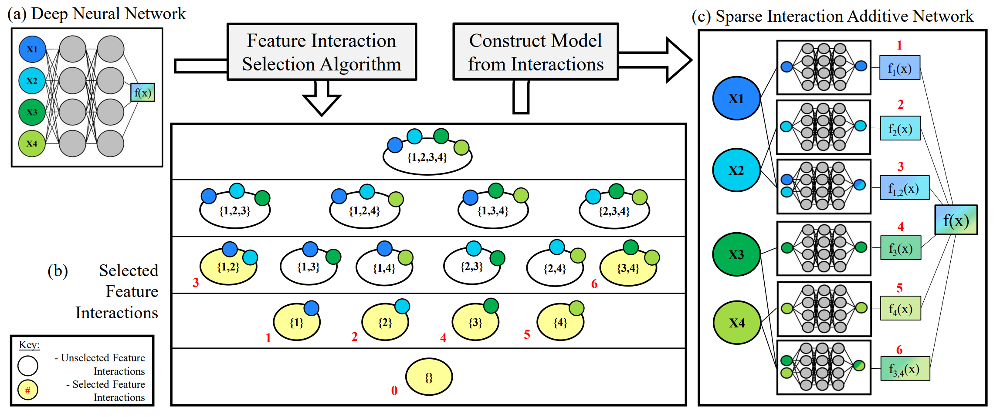
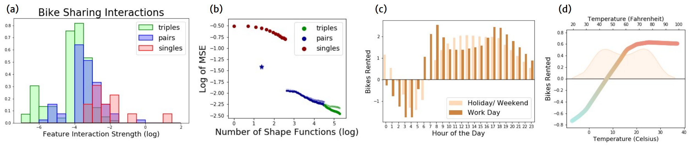
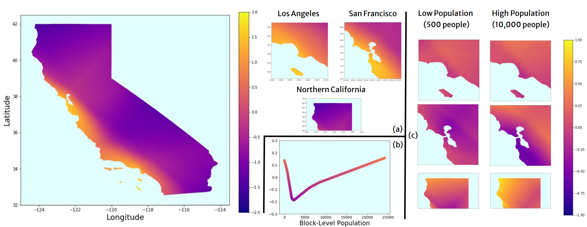
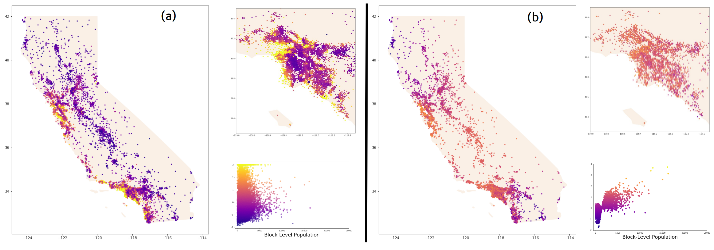

# Sparse Interaction Additive Networks (SIAN)

This is the github repository for the Neurips 2022 paper "Sparse Interaction Additive Networks 
via Feature Interaction Detection and Sparse Selection" available at: 
(https://arxiv.org/abs/2209.09326).


#### Figure 1: SIAN Pipeline

<br>

SIAN is a neural additive model (NAM) which extends previous work like <a href="https://arxiv.org/abs/2106.01613" target="_blank">NODE-GAM</a> from one-dimensional and two-dimensional functions to higher-order functions (primarily focusing on three to five dimensional functions).
We begin by (a) training a typical multilayer perceptron (MLP) on the dataset; (b) then using a post-hoc interpretability metric (<a href="https://arxiv.org/abs/2006.10965">Archipelago</a>) alongside our FIS algorithm to extract the most important feature interactions or feature subsets from the partially trained MLP; (c) finally, we use the important feature interactions as a blueprint for the architecture of the neural additive model and train the constructed SIAN model.
<br>

## Performance

Performance across seven different tabular datasets (five in the regression setting, reporting mean squared error; two in the classification setting, reporting AUROC) is plotted below in Table 1.
Although SIAN is not state-of-the-art on many of the datasets, SIAN is able to consistently achieve good performance across all datasets by finding the right balance between the good generalization
of simple models and the good training fit of deep neural networks.
This balance lets it achieve the highest average rank over all seven datasets.
Our results also demonstrate that SIAN can outperform MLPs on all but the two largest datasets, Song Year and Higgs Boson.
Moreover, SIAN outperforms all previously existing additive models (degree one or two) on all of the high-dimensional datasets.
Bold indicates the best-performing method, highlight indicates the best-performing SIAN.

Since our method slowly transitions from a simple linear model to a full complexity MLP, SIAN is able to give fine-grained
insights into the interpretability-accuracy tradeoff.
Further, our experiments focused on 3-layer ReLU networks, but our implementation generalizes to any activation function or 
network shape.
Greater details on how to use these inductive biases can be used and how we extended NODE-GAM to a three-dimensional NODE-GA3M model are
provided in the paper.


#### Table 1: Performance Across All Datasets
|     Model     | | Energy | Bike | Housing  |  Wine | Song Year |  | Higgs Boson | MIMIC-III |
| :-: |-  |-|-|-|-|-|  - |-|-|
|LASSO             | | 0.740±0.002  | 1.053±0.001 | 0.478±0.000 | 0.575±0.002  |     1.000±0.008    |  |  0.635±0.000  | 0.568±0.001 | 
|GA2M EBM          | | 1.053±0.138  | 0.124±0.004 | 0.265±0.002 | 0.498±0.004  |  0.894±0.001        |  | 0.698±0.001  | 0.840±0.001 | 
|NODE-GA2M         | |  1.064±0.056 | **0.111±0.006** | **0.222±0.005** | 0.521±0.009  | 0.806±0.001 |  | 0.811±0.000| 0.826±0.001 | 
|SIAN-1          | | **`0.718±0.007`**  | 0.387±0.035 | 0.378±0.007 | 0.551±0.004 | 0.860±0.001        |  | 0.771±0.001 | 0.848±0.001 | 
|SIAN-2          | | 0.763±0.009        | `0.127±0.008` | 0.302±0.002 |  0.497±0.003 |       0.842±0.002   |  | 0.795±0.001 | **`0.855±0.001`** | 
|SIAN-3          | | 0.808±0.026        | `0.125±0.013` |  0.278±0.001 | 0.497±0.003 |    0.831±0.001     |  | 0.798±0.001 | **`0.856±0.001`** | 
|SIAN-5          | | 0.801±0.031         | 0.149±0.011 | `0.272±0.003` | `0.484±0.006`    |   `0.821±0.001`  |  |   `0.802±0.001`  | **`0.856±0.001`** | 
|RF             | | 1.114±0.095 | 0.206±0.009 | 0.271±0.001 |     **0.439±0.005** |   0.994±0.005  |  |  0.654±0.002 | 0.821±0.001 | 
|SVM            | |  0.740±0.008    | 0.168±0.001 | 0.262±0.001 | 0.457±0.008 | 0.940±0.012        |  |0.698±0.001 |  0.831±0.001 | 
|XGB            | | 1.188±0.119    | 0.157±0.003 | 0.229±0.002 |  0.465±0.014 |  0.881±0.002       |  |0.740±0.000 |    0.843±0.001 | 
|DNN           | | 0.945±0.054  | 0.374±0.017 | 0.283±0.005 |   0.495±0.007 |   **0.791±0.002**    |  |  **0.823±0.000**   | 0.844±0.001 | 


#### Table 2: Dataset Details
|Dataset | Number of Samples  | Number of Features | Class Imbalance |
| :- | -: | -: | -: |
|Energy     | 19,735  | 30 | -- |
|Bike       | 17,379  | 13 | -- |
|Housing    | 20,640  | 8 | -- |
|Wine       |  6,497  | 12 | -- |
|Song Year |  515,345  | 90 | -- |
|Higgs Boson | 11,000,000  | 28 | 53.0% |
|MIMIC-III  |    32,254    | 30 | 9.2%  |

## Visualizations
Some example visualizations which are made possible by our SIAN pipeline.

#### Figure 2: Bike Sharing SIAN

<br>

In Figure 2a, we plot a histogram of the strength of the feature interactions, color-coded and vertically scaled by the degree/ dimension of the feature interaction.
In Figure 2b, we plot the train MSE and the validation MSE (darker and lighter) of a SIAN model as we cumulatively add feature interactions in order of degree and then in order of strength.
The blue star corresponds to the performance of the combination of the shapes in 2c and 2d, finding a relatively good accuracy for an extremely succinct model.
Figure 2c corresponds to the two-dimensional shape function showing how many bike rentals occur each hour of the day for both holidays and work days.
Figure 2d demonstrates the one-dimensional relationship between temperature and number of bike rentals per hour.


#### Figure 3: California Housing SIAN

<br>

#### Figure 4: California Housing Post-Hoc

<br>

In Figures 3 and 4, we explore the California Housing dataset which tries to predict the median house price for many locations in California.
In Figure 3, we plot the three-dimensional SIAN shape function relating latitude, longitude, and population to the median house price.
We attempt this daunting task by first looking at the 2D function of location in Figure 3a.  We then look at the 1D function of population in Figure 3b.
We then look at how location and population interact in Figure 3c.  Further details are available within the paper.

In Figure 4, we compare the interpretability provided by additive models with the interpretability provided by post-hoc explanations applied to 
blackbox models.
In Figure 4a, we plot the original dataset with no alteration.
In Figure 4b, we apply the local interpretability technique of Archipelago to the dataset with the provided features.
Although both give some insight into the data, neither can exactly explain why a model will make its predictions, especially on out of distribution
regions like in California's desert. 

<br>

## SIAN Demonstration
We provide a demonstration of the SIAN workflow in `code/bikeshare_demo.ipynb` which goes through training an MLP,
detecting feature interactions, building a SIAN model, and training a SIAN model on the bike sharing dataset. (pytorch)

We reiterate the key steps here as:

Training an MLP
```python
data = load_dataset()
my_MLP = MLP()

#training the MLP
```

Detecting Interactions
```python
interactions = aggregateContrastiveDetections_only2D(my_MLP,data)

#plotting the interactions

#accumulating the strongest interactions
```

Training a SIAN
```python
my_SIAN = SIAN(best_interactions)

#training the SIAN
```

<br>

## Citations

```
@inproceedings{enouen2022sian,
    title={Sparse Interaction Additive Networks via Feature Interaction Detection and Sparse Selection},
    author={James Enouen and Yan Liu},
    booktitle={Advances in Neural Information Processing Systems},
    year={2022}
}
```
  