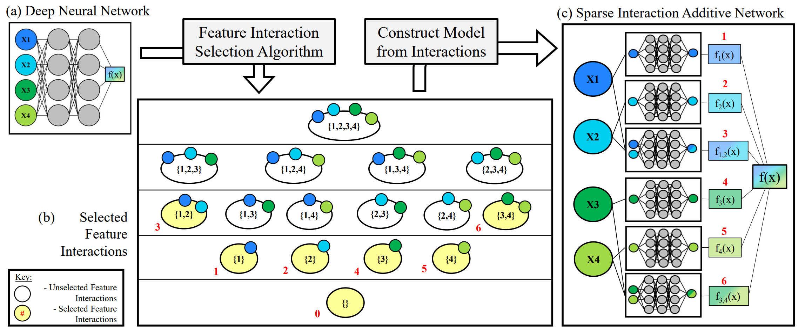

# Sparse Interaction Additive Networks (SIAN)

This was the github repository for the Neurips 2022 paper "Sparse Interaction Additive Networks 
via Feature Interaction Detection and Sparse Selection" available at: 
(https://arxiv.org/abs/2209.09326).

Please visit the package at https://github.com/EnouenJ/sian.

<div style="display: flex; justify-content: center; margin-left: auto; margin-right: auto;">
<a href="https://github.com/EnouenJ/sian">
<button style="font-size: 1.5rem; padding: 12px 24px;">EnouenJ/sian</button>
</a>
</div>

# <kbd>[**Button Text**](https://github.com/EnouenJ/sian)</kbd>

# <kbd>[Button Text](https://github.com/EnouenJ/sian)</kbd>

[fork my repository](https://github.com/user/repository/fork)

<a href="https://github.com/EnouenJ/sian">

</a>


The legacy repository can be found at the <a href="https://github.com/EnouenJ/sparse-interaction-additive-networks/tree/legacy2022">legacy2022</a> branch.


## Citations

```
@inproceedings{enouen2022sian,
    title={Sparse Interaction Additive Networks via Feature Interaction Detection and Sparse Selection},
    author={James Enouen and Yan Liu},
    booktitle={Advances in Neural Information Processing Systems},
    year={2022}
}
```

```
@inproceedings{enouen2025instaSHAP,
    title={InstaSHAP: Interpretable Additive Models Explain Shapley Values Instantly},
    author={James Enouen and Yan Liu},
    booktitle={International Conference on Learning Representations},
    year={2025}
}
```
  